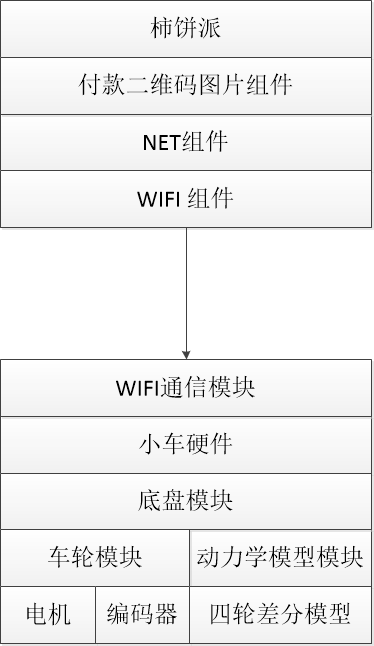
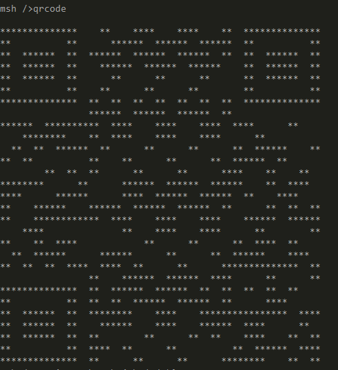
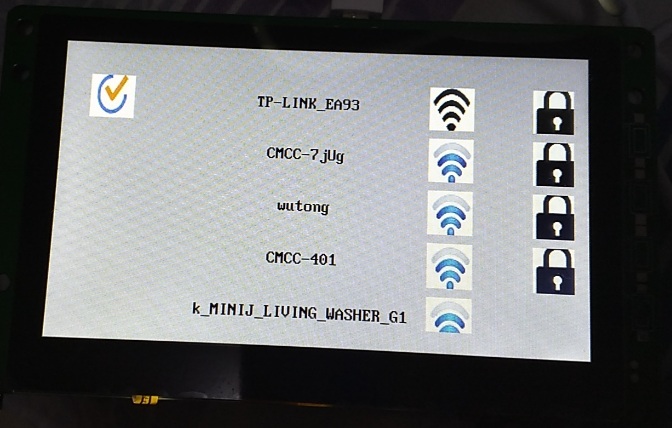
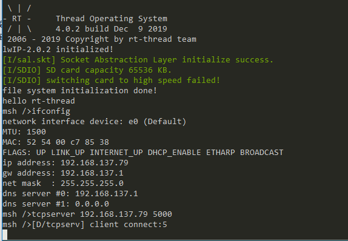
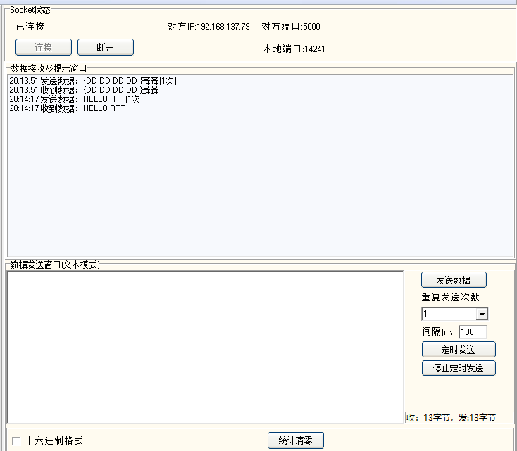

# 柿饼派游戏机

基于柿饼派的游戏主机，目前主要是柿饼派使用wifi通信 作为客户端 用来控制基于RT-Thread  rt-robot 软件包小车,小车主控板使用潘多拉板子。

# 实现功能

- 通过扫码柿饼派上支付二维码，获得授权，才能进入小车游戏控制界面；

- 柿饼派连接指定wifi，并以socket 客户端，连接指定小车；

- 通过柿饼派对小车进行前进后退等操作;

- 将小车采集的相关信息显示在游戏主机上；

- 几个小车可以互动共同完成游戏任务。

  

# 软件框架说明



1. 柿饼派使用 wifi 控件 及net 控件 作为client 连接 server 端的小车;
2. 小车主控板为潘多拉板子，使用rt-robot 软件包控制小车地盘电机；
3. 小车通信使用rt-thread SAL 组件 作为server 端 接收 柿饼派发送的控制命令，进行响应。

# 软件包使用说明

主要介绍项目中使用到的软件包，也包括测试的一些软件包，比如二维码软件包。使用的软件包如下 : qrcode，rt-robot,cJSON,TCP server,

## 1.qrcode 二维码软件包

最终可用于在潘多拉的LCD 上显示 车辆信息，类似与共享单车上的二维码，基于此二维码进行相关控车操作。目前只是测试代码。

- 对于二维码大小的控制，清晰度是否可识别还有待测试。

[qrcode 软件包地址]( https://github.com/RT-Thread-packages/qrcode )

##  2.rt-robot 软件包

主要用于小车控制。目前代码中是开环四轮驱动，未实现闭环。

[rt-robot软件包地址](https://github.com/RT-Thread-packages/rt-robot)

## 3.cJSON

[cJSON软件包地址](https://github.com/RT-Thread-packages/cJSON)

[cJSON 带例子说明](https://github.com/DaveGamble/cJSON)

## 4.TCP server

[TCP server 软件包地址](https://github.com/Guozhanxin/tcpserver)

***注意***

- tcpserver_sample.c 中 导出命令要有分号。下载的软件包中没有，导致无法导出命令。

  

   `MSH_CMD_EXPORT(tcpserver, server start);` 

  `MSH_CMD_EXPORT(tcpserver_stop, tcpserver stop);`

  

  

  

# 演示效果

## 1.qrcode



## 2.柿饼控制界面




## 3.小车跑起来

[car](.\car\stm32l475-atk-pandora\docs\car.mp4)

- 只是自己跑起来，还么有联动起来。

## 4.TCP server

这个软件包还是非常不错的。直接可以来作为服务端来使用。





## 各组件集成起来

暂无。

# 代码地址

[game console](https://github.com/XiaojieFan/game_console)


# 代码目录结构

```
.
|-- README.md                       // 说明
|-- car                            // 小车控制及通信代码
|-- wifiControler                  // 柿饼派js 代码

```